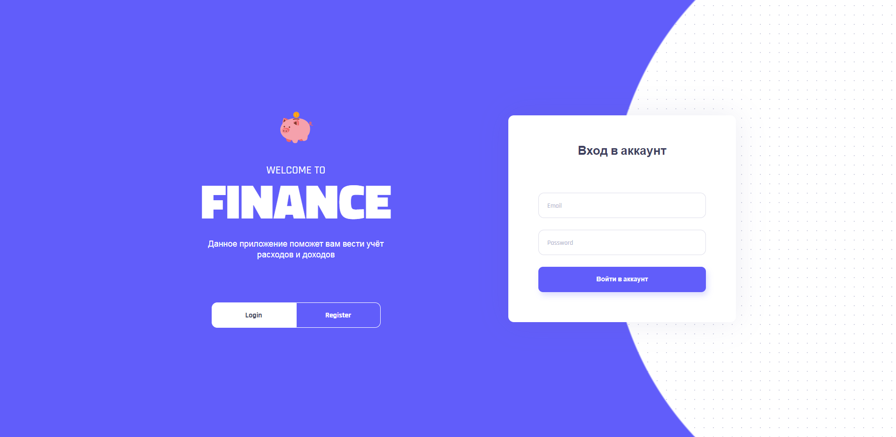
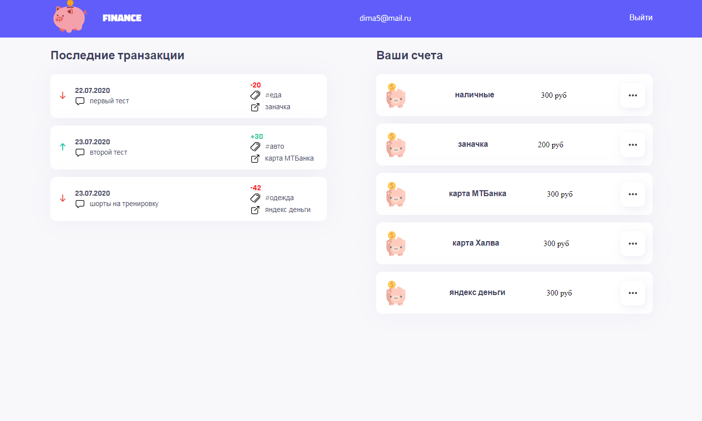
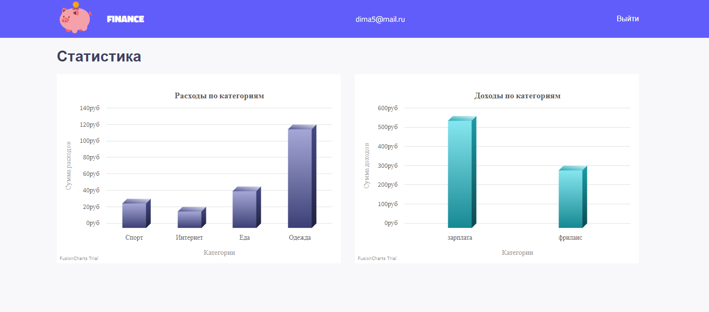

## Pet project: Приложение для учёта доходов и расходов

🖥️ Главная страница сайта: https://kubarski-mern-finance.herokuapp.com/




## Основной стек технологий (MERN):
- Mongodb
- Express
- React
- Node

## Особенности:
- Все данные хранятся в базе данных - *Mongodb*,
- Присутсвует валидация форм как на стороне сервера, так и на стороне клиента,
- Регистрация осуществляется с помощью email и пароля (планирую добавить google и соц.сети)

## Описание приложения:



**Основные сущности**
```
- Основные сущности это: транзакции, категории и счета.
- Есть фильтр, который может показать транзакции по типу операции (доходы или расходы), по категории, по счёту...
- Есть статистика в виде графиков.
```

**Cчета**
```
Это источники финансов. Например "Зарплатная карта", "Яндекс деньги", "Банк", "Копилка", "Заначка" ...
В приложении можно: создать, удалить и отредактировать выбранный счёт.
```

**Категории**
```
Категории необходимы для структурирования транзакций, а также для наглядной статистики по расходам и доходам. 
Например мы можем увидеть куда тратим больше всего денег: "еда", "спорт", "авто", "путешествия"...
Или увидеть от куда больше всего доходов: "фриланс", "работа-1", "работа-2" ... 
В приложении можно: создать, удалить и отредактировать выбранную категорию.
```

**Транзакции**
```
Транзакция - это некая операция, которая либо списывает деньги, либо наоборот.
Для создания транзакции необходимо обязательно заполнить все поля в форме:
- тип операции (доходы \ расходы)
- счёт, с которого будет списана сумма (или наоборот)
- категория, к которой можно отнести данную транзакцию (например "покупка абонимента в зал", логично выбрать категорию "спорт")
- дата (по умолчанию всегда выбрана актуальная на момент создания, но её можно отредактировать, например если нужно провести транзакцию задним числом)
- комментраий, чтобы потом понимать смысл транзакций, например: "купил молоко", "оплатил кредит", "заправил машину" ...
- сумма
```



## Что было сделано:

- [ ] Работа с базой данных «mongodb»: подключение к базе, поиск и получение документов в базе по разным полям, сортировка, фильтрация с помощью агрегации, установка лимитов…
- [ ] Создние сервера на node.js с использованием express.
- [ ] Создание REST API.
- [ ] Аутентификация и авторизация с использованием JWT токена.
- [ ] Работа с кастомными хуками.
- [ ] Создание защищённых роутов.
- [ ] Деплой node.js приложения на VPS сервер с привязкой своего домена / деплой на heroku.

------------

Сделано с ❤️ к web-разработке.

------------
